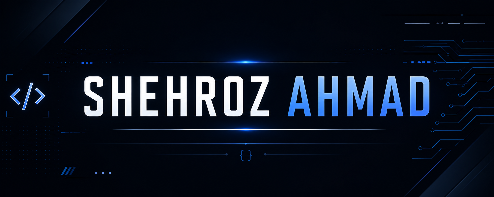

  

  <b> 💻 Software Engineer | Full-Stack Developer | Pakistan</b>

  I'm a Computer Science graduate and Software Engineer passionate about
building scalable, reliable, and user-focused software applications.

---

## 💫 About Me

- 👨‍💻 Software Engineer focused on Full-Stack Development
- 🎓 Computer Science Graduate
- 🌐 Passionate about building modern web applications
- ⚙️ Interested in Backend Engineering and Software Architecture
- 🧠 Strong interest in problem solving and writing clean, maintainable code
- 🤖 Interested in integrating AI into modern software applications
- 🔐 Interested in building secure and reliable software systems
- 📚 Continuously learning and improving my engineering skills

---

## 🌐 Connect With Me

  
  

---

## 💻 Tech Stack

### 👨‍💻 Programming Languages

  

### 🎨 Frontend Development

  

### ⚙️ Backend Development

  

### 🗄️ Databases & Backend Services

  

### 🤖 AI / Machine Learning

  

### ☁️ Cloud & Deployment

  

### 🛠️ Tools & Technologies

  

---

## 📚 Currently Learning

- Advanced Backend Development
- Software Architecture & System Design
- Scalable Application Design
- Advanced React & Next.js
- AI Integration in Software Applications

---

## 📊 GitHub Stats

  
  

---

  <i>Building, learning, and improving one line of code at a time.</i>

